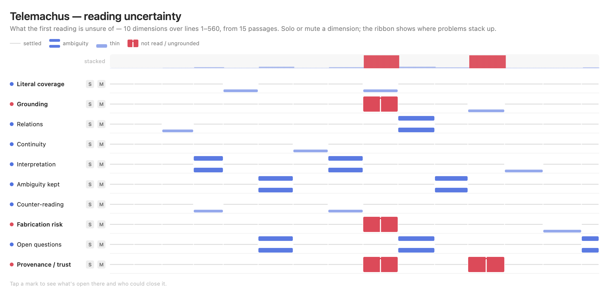

# UncertaintyScoreKit

**Status:** 0.1.0 — first cut. The model, the SwiftUI renderer, and a snapshot harness. Encoding proven by eye in
light and dark; not yet tuned against large real datasets.

UncertaintyScoreKit renders **what a first pass is unsure of** as a browsable score — an *orchestra of dimensions*
(instruments) over a shared *spine* (source order, time, or any 1-D coordinate). It exists for a specific, repeated
mistake: expecting a first reading — a close reading, an extraction, a classification run — to hand back settled,
confident answers, when what it is actually equipped to produce reliably is a **well-formed account of its own
uncertainty**. So the deliverable is not a confident index. It is a multi-dimensional map of what remains open — and,
for each open thing, a cue to who could close it.

Pure Swift, zero non-Swift dependencies. See `AGENTS.md` for agent instructions and `docs/` for the design.



## Why a score

A single confidence bar throws away exactly the information a later stage needs. Uncertainty has **dimensions** — a
passage can be perfectly grounded, referentially ambiguous, and interpretively contested all at once — so the model
keeps them as separate lanes. Because the lane (its row and label) carries a dimension's identity, colour is free to
carry **state** instead, and the whole palette is two colourblind-safe status hues plus neutral ink.

The interaction is a mixing desk: **solo** one dimension to read it alone, **mute** the settled ones, and read the
`stacked` ribbon at the top for triage — where many instruments play loud at once is where problems pile up.

## The four states — and the one hard line

| State | Meaning | Shape |
|---|---|---|
| `settled` | assessed and confident | a faint hum line |
| `thin` | present but under-supported | a low single bar |
| `ambiguity` | genuinely open — the material supports competing readings | a **held dyad**: two bars, sounded together |
| `failure` | not assessed, ungrounded, or fabrication risk | a **loud broken block** with a silence cut through it |

The line the whole library is built to keep: **`ambiguity` is a result; `failure` is a breakdown.** They render
differently in kind — failure is louder and shaped as an *absence* — so a broken pass can never masquerade as honest
ambiguity. Enforced as a type rule, not a hope: **absence is explicit.** There is no implicit "settled" fill; a
dimension never assessed for a span simply has no note there.

## Architecture — Functional Core, Imperative Shell

- **`UncertaintyScoreKit`** — the functional core. `UncertaintyScore` / `UncertaintyLane` / `UncertaintyNote` /
  `UncertaintyState`: pure value types and total functions (`openness(at:)`, `peakState`). No I/O, no UI, no
  dependencies. A producer adapts its own artifacts into these — the core never learns what a "reading" is.
- **`UncertaintyScoreKitUI`** — the imperative shell. `UncertaintyScoreView`: SwiftUI, theme-aware, the mixer, and
  the validated shape+colour encodings.
- **`UncertaintyScoreDemo`** — the shell's snapshot harness; renders fixtures to PNG so the encoding is *looked at*,
  not asserted.

## Usage

```swift
import UncertaintyScoreKit
import UncertaintyScoreKitUI

let score = UncertaintyScore(
    title: "My reading",
    spineStart: 1, spineEnd: 560, itemCount: 15,
    lanes: [
        UncertaintyLane(id: "grounding", title: "Grounding", isFailureAxis: true, notes: [
            UncertaintyNote(id: "g1", start: 1, end: 96, state: .settled, detail: "Grounded."),
            UncertaintyNote(id: "g2", start: 291, end: 330, state: .failure,
                            detail: "Claims cite no line in range.", resolvedBy: "re-observe the passage")
        ])
        // …one lane per dimension, in a fixed order
    ]
)

UncertaintyScoreView(score: score)   // drop into any SwiftUI surface
```

The producer owns the adapter from its own artifacts into `UncertaintyScore`; keeping that seam on the producer's
side is what lets the same view draw the uncertainty of anything — a close reading, log triage, a labelling run.

## Build, test, snapshot

```bash
swift build
swift test
swift run UncertaintyScoreDemo ./out    # writes uncertainty-<fixture>-<light|dark>.png
```

## License

MIT © 2026 Fountain Coach. See `LICENSE`.
